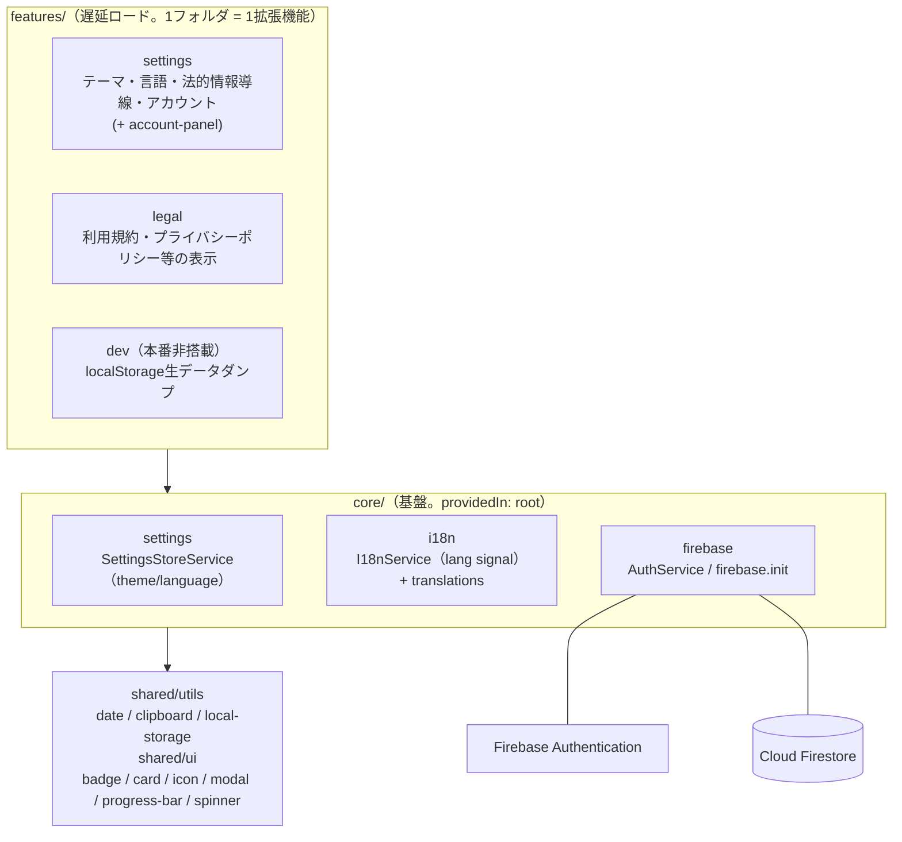
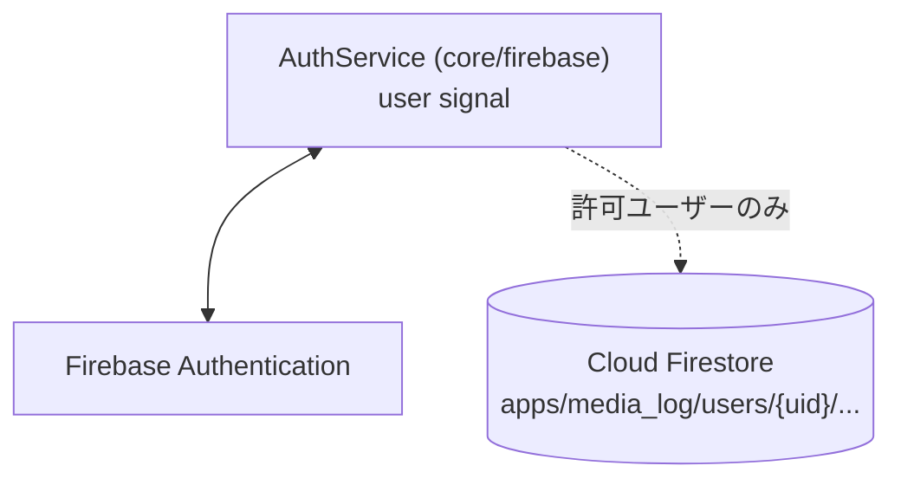
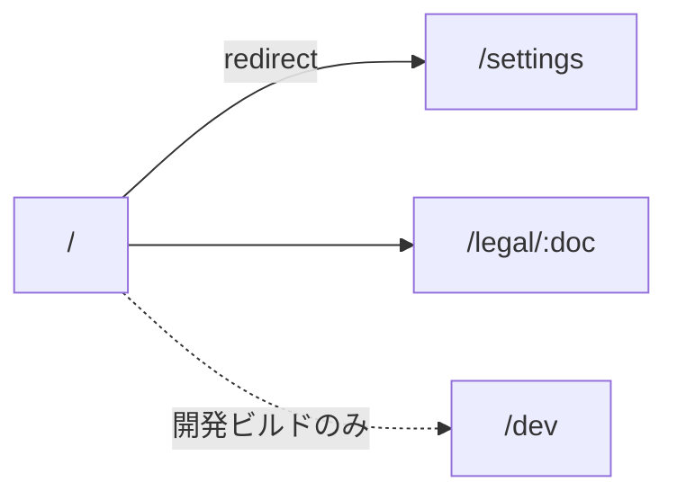

# ARCHITECTURE.md — Media Log アーキテクチャ

## 1. レイヤ構成（共通パターン）

コードベースは3層の一方向依存で構成される。**すべての機能追加はこのパターンの繰り返し**であり、
新しい拡張機能（feature）は `features/` にフォルダを1つ追加し、core のサービスを inject するだけでよい。

```
features/ ──▶ core/ ──▶ shared/
（拡張機能）  （基盤）   （汎用util）
```

- **features/** … 遅延ロードされるページ単位の拡張機能。ページ専用の service / util / guard は同じフォルダに同居する。feature 間の依存は禁止。
- **core/** … 全 feature が共有する基盤（設定・Firebase・多言語表示）。feature を import してはならない。
- **shared/** … アプリのドメインに依存しない汎用ユーティリティ（日付・クリップボード・localStorage等）とUIコンポーネント（badge/card/icon/modal/progress-bar/spinner）。



### レイヤ境界の機械強制

`features → core → shared` の一方向依存および feature 間 import 禁止は、`eslint-plugin-boundaries`
（`eslint.config.js`）により `npm run lint` 時に機械的に検証される。パスエイリアス（`@core/*` /
`@shared/*` / `@features/*`）の解決には `eslint-import-resolver-typescript` を使う。

### 変更検知

全コンポーネントは `ChangeDetectionStrategy.OnPush` を採用する（リポジトリ全体の規約）。
状態は signal ベースで保持され、`OnPush` と組み合わせて変更検知範囲を最小化する。

---

## 2. 認証・クラウド同期（プラットフォーム共通パターン）

`AuthService`（core/firebase）が Google SSO ログイン状態を `user` signal で保持する。
クラウド同期はホワイトリスト制（`auth.constants.ts` の `ALLOWED_SYNC_EMAILS`、Firestore側は
`firestore.rules` の `isAllowedUser()`）で、許可されたユーザーの本人 UID サブツリーのみ
読み書きできる。



Phase 2 で作品・記録のデータモデルを追加する際は、`SessionRepositoryService`（他アプリ eibun-lab の
セッション管理実装）のような「ローカル保存 → Firestoreへfire-and-forget push」パターン、および
tombstone方式の論理削除（`deleted` フラグ + OR結合マージ）を踏襲することを推奨する。

---

## 3. ルーティング



`environment.production` が true のとき、[app.routes.ts](src/app/app.routes.ts) は `/dev` ルートを
登録しない。Service Worker は本番ビルドのみ有効。

Phase 2で作品/記録機能（`features/works`, `features/logs` 等）を追加する際は、デフォルトルート
（現在は `/settings` にリダイレクト）をそちらに差し替えること。

---

## 4. i18n（多言語表示）

`I18nService`（core/i18n）が `lang` signal（`'ja' | 'en'`）を保持し、UI文言は
`core/i18n/translations/index.ts` の `TRANSLATIONS` 辞書から `t()` で引く。翻訳はセクションごとに
ファイルを分割し（`common.ts` / `settings.ts`）、`index.ts` でマージする。Phase 2で機能を追加する
際は同じ分割パターンで翻訳ファイルを追加すること。

---

## 5. 法的情報ページ（legal）

[legal.ts](src/app/features/legal/legal.ts) は `docs/legal/{doc}.md` を実行時に `fetch()` して
Markdownを表示する。`angular.json` のビルドアセット設定で `docs/legal` を `dist/.../legal/` へ
ディレクトリ単位でコピーしている。`docs/legal/` を移動・改名する場合は、この2箇所を必ず
同時に更新すること（詳細は [docs/index.md](docs/index.md) の「ドキュメントリファクタリング方針」）。
