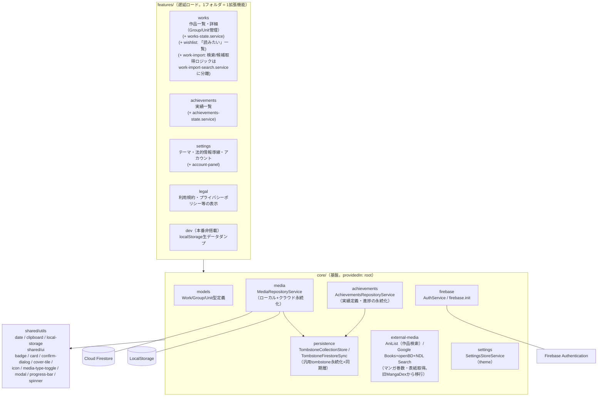
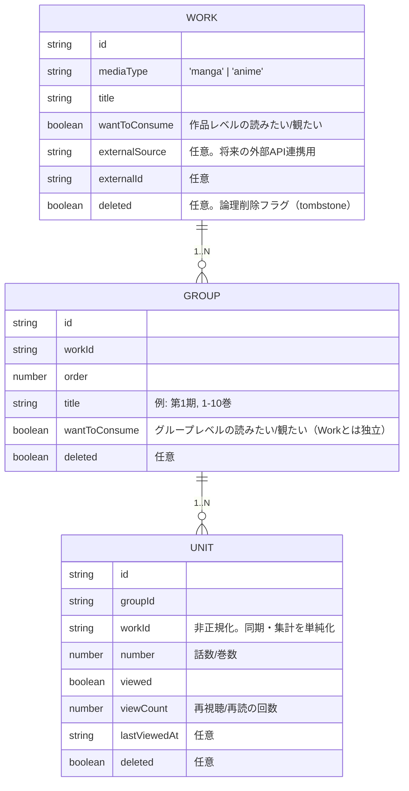
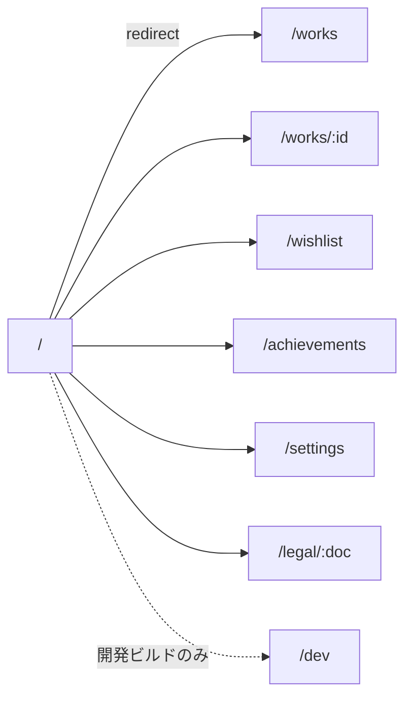

# ARCHITECTURE.md — Media Log アーキテクチャ

## 1. レイヤ構成（共通パターン）

コードベースは3層の一方向依存で構成される。**すべての機能追加はこのパターンの繰り返し**であり、
新しい拡張機能（feature）は `features/` にフォルダを1つ追加し、core のサービスを inject するだけでよい。

```
features/ ──▶ core/ ──▶ shared/
（拡張機能）  （基盤）   （汎用util）
```

- **features/** … 遅延ロードされるページ単位の拡張機能。ページ専用の service / util / guard は同じフォルダに同居する。feature 間の依存は禁止。
- **core/** … 全 feature が共有する基盤（設定・Firebase・作品/記録データモデルと永続化）。feature を import してはならない。
- **shared/** … アプリのドメインに依存しない汎用ユーティリティ（日付・クリップボード・localStorage等）とUIコンポーネント（badge/card/confirm-dialog/cover-tile/icon/media-type-toggle/modal/progress-bar/spinner）。

feature内のコンポーネントが外部API呼び出し・検索条件・結果整形など複数責務を持ち始めた場合は、
同じフォルダに専用サービス（例: `work-import/work-import-search.service.ts`）を切り出し、
コンポーネントはUI選択状態とサービス呼び出しの橋渡しに専念させる。この分割はfeature内で完結し、
他featureやcoreへは影響しない。書籍・映画などメディア種別拡張時にロジックを再利用・差し替えしやすくする狙い。



### レイヤ境界の機械強制

`features → core → shared` の一方向依存および feature 間 import 禁止は、`eslint-plugin-boundaries`
（`eslint.config.js`）により `npm run lint` 時に機械的に検証される。パスエイリアス（`@core/*` /
`@shared/*` / `@features/*`）の解決には `eslint-import-resolver-typescript` を使う。

### 変更検知

全コンポーネントは `ChangeDetectionStrategy.OnPush` を採用する（リポジトリ全体の規約）。
状態は signal ベースで保持され、`OnPush` と組み合わせて変更検知範囲を最小化する。

---

## 2. データモデル（Work → Group → Unit）

`core/models/media.model.ts` に、作品(Work)→グループ(Group)→単位(Unit)の3階層を定義する。
mediaType を問わず共通の形で、将来 movie（Group1件・Unit1件）や book（mangaと同形）にも
そのまま拡張できる。



`wantToConsume` はWork/Group両方に独立して持てる（片方を立てても他方に影響しない）。UI側の
「読みたいリスト」は、Workの`wantToConsume`が立っている作品と、配下いずれかのGroupの
`wantToConsume`が立っている作品（該当Groupのみ表示）の両方を`WorksStateService`が`computed`で
集約して表示する（`features/works/works-state.service.ts`）。

---

## 3. 永続化（ローカル + クラウド同期）

localStorage永続化 + tombstone論理削除 + Firestore双方向同期という組み合わせは、mediaType非依存の
汎用層として`core/persistence/`に1度だけ実装されている（旧: media/achievementsそれぞれが個別に
同じロジックを持っていた三重複を統合した）。姉妹アプリeibun-labの`SessionRepositoryService`/
`FirestoreSyncService`と同じ「ローカル保存 → Firestoreへfire-and-forget push」パターンを踏襲する。

### `core/persistence/`（汎用層）

- **`tombstone-collection.store.ts`**: `createTombstoneCollectionStore<T>(storageKey, onStorageFull)`。
  1つのlocalStorageキーに対するCRUD（`persist`/`save`/`softDelete`）をsignalで提供する。
  `all`（tombstone含む全件。Firestore同期の突き合わせ用）と`visible`（削除済み除外。表示・集計用）
  の2つのビューを持つ。別タブでの変更は`storage`イベントで検知し再読込する。
- **`tombstone-firestore-sync.ts`**: `createTombstoneFirestoreSync<T>(config)`。
  `AuthService.user()`を`effect()`で監視し、ログイン時に
  `apps/media_log/users/{uid}/{collectionName}/{id}`と双方向マージ（`deleted`はOR結合）。
  以後の保存操作はfire-and-forget push、失敗分は`pendingPush`に保持し`online`イベントで再送する。
- **`tombstone-sync.util.ts`**: `mergeByIdWithTombstone`（idで突き合わせてdeletedをOR結合）/
  `stripUndefinedShallow`（Firestoreがundefinedを受け付けないための浅い除去）。

新しいドメインデータを追加する際は、この2関数を対象の型でインスタンス化して束ねるだけで
ローカル永続化+tombstone論理削除+Firestore双方向同期が揃う（下記`core/media`/`core/achievements`
参照）。

### `core/media/`（Work/Group/Unit）

- **`media-store.service.ts`**: works/groups/unitsそれぞれに対して`createTombstoneCollectionStore`を
  生成し束ねる薄いラッパー。固有ロジックはWork削除時に配下のGroup/Unitも連動してtombstone化する
  カスケード削除のみ。
- **`media-firestore-sync.service.ts`**: works/groups/unitsそれぞれに対して
  `createTombstoneFirestoreSync`を生成し束ねる薄いラッパー。
- **`media-repository.service.ts`**: 上記2つを束ねるファサード。`features/works`はこのサービスのみを
  inject する。

### `core/achievements/`（Achievement）

`achievements-store.service.ts` / `achievements-firestore-sync.service.ts`も同型のパターンで、
単一コレクション（`achievements`）につき`createTombstoneCollectionStore`/
`createTombstoneFirestoreSync`を1つずつ生成する。`achievements-repository.service.ts`が
`features/achievements`向けのファサード。

```mermaid
graph TD
    Works["features/works\n(WorksStateService)"]
    Repo["MediaRepositoryService (core/media)"]
    Store["MediaStoreService"]
    Sync["MediaFirestoreSyncService"]
    Achievements["features/achievements\n(AchievementsStateService)"]
    AchRepo["AchievementsRepositoryService (core/achievements)"]
    AchStore["AchievementsStoreService"]
    AchSync["AchievementsFirestoreSyncService"]
    CollectionStore["TombstoneCollectionStore\n(core/persistence)"]
    FirestoreSync["TombstoneFirestoreSync\n(core/persistence)"]
    Auth["AuthService (user signal)"]

    Works --> Repo --> Store --> CollectionStore
    Repo --> Sync --> FirestoreSync
    Achievements --> AchRepo --> AchStore --> CollectionStore
    AchRepo --> AchSync --> FirestoreSync
    FirestoreSync -->|user signalをeffect()で監視| Auth
    FirestoreSync <--> Firestore[("apps/media_log/users/{uid}/{collection}")]
    CollectionStore <--> LocalStorage[("LocalStorage")]
```

---

## 4. 認証（プラットフォーム共通パターン）

`AuthService`（core/firebase）が Google SSO ログイン状態を `user` signal で保持する。
クラウド同期はホワイトリスト制（`auth.constants.ts` の `ALLOWED_SYNC_EMAILS`、Firestore側は
`firestore.rules` の `isAllowedUser()`）で、許可されたユーザーの本人 UID サブツリーのみ
読み書きできる。

---

## 5. ルーティング



`environment.production` が true のとき、[app.routes.ts](src/app/app.routes.ts) は `/dev` ルートを
登録しない。Service Worker は本番ビルドのみ有効。

---

## 6. UI言語

UI言語は日本語のみ（i18n基盤は撤去済み）。文言は各コンポーネントのテンプレートに直接記述する。

---

## 7. 法的情報ページ（legal）

[legal.ts](src/app/features/legal/legal.ts) は `docs/legal/{doc}.md` を実行時に `fetch()` して
Markdownを表示する。`angular.json` のビルドアセット設定で `docs/legal` を `dist/.../legal/` へ
ディレクトリ単位でコピーしている。`docs/legal/` を移動・改名する場合は、この2箇所を必ず
同時に更新すること（詳細は [docs/index.md](docs/index.md) の「ドキュメントリファクタリング方針」）。
